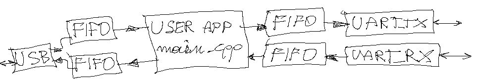

# stmidi
USB MIDI to serial converter. Each MIDI event received via USB is translated and sent to USART2, and each MIDI event from USART2 is sent to USB. Each event is sent to the user application (currently, the user application does nothing except copy and translate events).

# how code was developed

1. Since CDC USB class is similar to MIDI device...
    CDC USB class code was generated by stm32cube (based on stmidi.ioc)
2. entire application code was put into stmidi/app
3. genarated files was copied to stmidi/app, renamed and then reworked
    /stmidi/USB_DEVICE/App/usbd_desc.h -> app/usb/UsbMidiDeviceDesc.h
    /stmidi/USB_DEVICE/App/usbd_desc.c -> app/usb/UsbMidiDeviceDesc.c
    /stmidi/Middlewares/ST/STM32_USB_Device_Library/Class/CDC/Src/usbd_cdc.h -> app/usb/UsbMidiClass.h
    /stmidi/Middlewares/ST/STM32_USB_Device_Library/Class/CDC/Src/usbd_cdc.c -> app/usb/UsbMidiClass.c
    /mnt/storage/projects/stm32cube_ws/midi2/USB_DEVICE/App/usbd_cdc_if.h -> app/usb/UsbMidiClassIf.h
    /mnt/storage/projects/stm32cube_ws/midi2/USB_DEVICE/App/usbd_cdc_if.c -> app/usb/UsbMidiClassIf.c
4. generated code was modified (only user sections) to use app/usb/UsbMidiClass.h/c and
    UsbMidiDeviceDesc.h/c, instead of original CDC defnitions
    (original CDC files was not removed, since after stm32cube code re-generation they would appear again,
     unused CDC symbols are removed by linker, so unused CDC files are left as they are,
     with such approach code could be re-generated by stm32cube many times without damaging user code) 
# what is implemented

